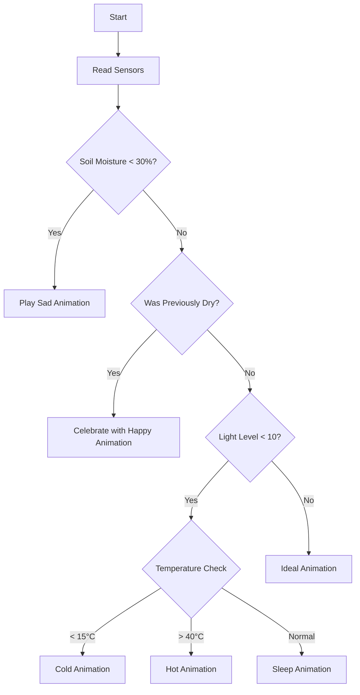

# 🌱 Bloom Buddy - Your Smart Plant Companion

<div align="center">
  
  
  
  
  [](https://opensource.org/licenses/MIT)
  [](https://www.espressif.com/en/products/socs/esp32)
  []()
</div>

## 🌟 Meet Your New Plant's Best Friend

Bloom Buddy is an intelligent, interactive soil moisture probe that transforms plant care into a delightful experience. This adorable ESP32-powered device doesn't just monitor your plants—it communicates with you through expressive animations, voice feedback, and real-time environmental monitoring.

Watch as Bloom Buddy celebrates when you water your plants, gets sad when they're thirsty, sleeps during the night, and reacts to temperature changes with personality-filled animations and sounds!

## ✨ Features

### 🎭 **Interactive Personality System**
- **Expressive Animations**: 12 different animated emotions (Happy, Sad, Sleep, Cold, Hot, and more)
- **Voice Feedback**: Contextual audio responses with randomized sound files
- **Smart State Management**: Remembers previous conditions to provide appropriate reactions

### 📊 **Comprehensive Environmental Monitoring**
- **Soil Moisture**: Precise moisture level detection with percentage conversion
- **Temperature & Humidity**: Real-time atmospheric monitoring (AHT20 sensor)
- **Light Detection**: Automatic day/night cycle recognition
- **Data Display**: On-demand sensor readings via button press

## 🛠️ Hardware Components

### Main Board
- **ESP32-based Controller** (UNIHIKER K10)
- **Analog Soil Moisture Probe**: Connected to pin P0

## 📁 SD Structure

```
SD/
  ├── Voice/
  │   ├── All Audio Files
  ├── Emoji/
  │   ├── All Frames
  ├── Face/
  │   ├── All Images
```

## 🚀 Quick Start

**Prerequisites**
- Arduino IDE 1.8.19 or below
- UNIHIKER K10 Board manager


**Prepare Audio Files**
   - Copy audio files to SD card in the structure shown above
   - Insert SD card into device

**Upload Code**
   - Open `BloomBuddy.ino` in Arduino IDE
   - Select ESP32 board
   - Upload to device

**Insert into Soil**
   - Place moisture probe into plant soil
   - Power on device
   - Watch Bloom Buddy come to life!

## 🎮 How It Works

### Behavior Logic



### Response Categories

| Condition | Animation | Voice Files | Behavior |
|-----------|-----------|-------------|----------|
| **Dry Soil** | Sad | D1-D5.wav | Continuous sad display until watered |
| **Just Watered** | Happy (4x) | W1-W6.wav | Celebration sequence |
| **Nighttime** | Sleep | N1-N5.wav | Calm, sleepy behavior |
| **Morning** | Ideal | M1-M4.wav | Wake up and active |
| **Cold** | Cold | C1-C2.wav | Shivering animation |
| **Hot** | Hot | H1-H2.wav | Overheated animation |

## 🔧 Configuration

### Sensor Thresholds
```cpp
const int DRY_THRESHOLD = 30;      // Moisture % threshold
const int DARK_THRESHOLD = 10;     // Light level threshold
const int COLD_THRESHOLD = 15;     // Cold temperature (°C)
const int HOT_THRESHOLD = 40;      // Hot temperature (°C)
```

### Calibration
Adjust moisture sensor calibration values based on your soil type:
```cpp
const int MOISTURE_WET_VALUE = 600;    // Wet soil reading
const int MOISTURE_DRY_VALUE = 3046;   // Dry soil reading
```

## 🎨 Customization

### Adding New Animations
1. Create new animation function in code
2. Add appropriate voice files to SD card
3. Integrate into main behavior logic

### Custom Voice Responses
- Record your own WAV files
- Follow naming convention (B1.wav, D1.wav, etc.)
- Place in `S:Voice/` directory on SD card

### Behavior Modification
- Adjust thresholds in configuration section
- Modify animation sequences
- Add new sensor-based conditions

## 📸 Gallery

| State | Animation | Description |
|-------|-----------|-------------|
| 😊 Happy |  | Plant is well-watered and content |
| 😢 Sad |  | Plant needs water |
| 😴 Sleep |  | Nighttime rest mode |
| 🥶 Cold |  | Temperature too low |
| 🥵 Hot |  | Temperature too high |

## 📄 License

This project is licensed under the MIT License

## 🙏 Acknowledgments

- UNIHIKER team for the excellent development board
- Thanks to the Arduino and ESP32 communities
- Plant enthusiasts who inspired this project
- 
---

🌱 Happy Gardening with Bloom Buddy! 🌱

Made with ❤️ for plants and their humans
